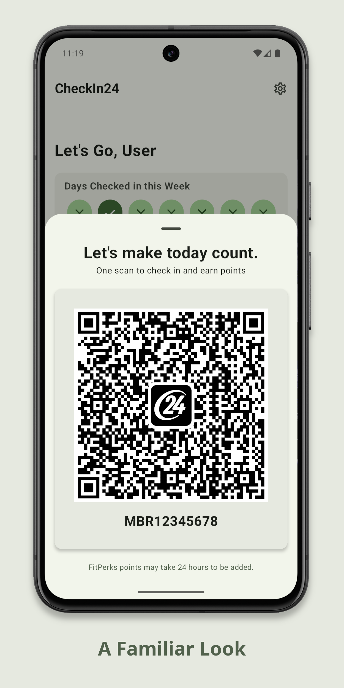
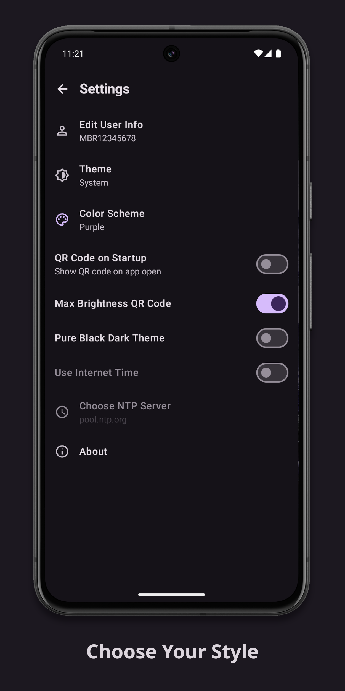
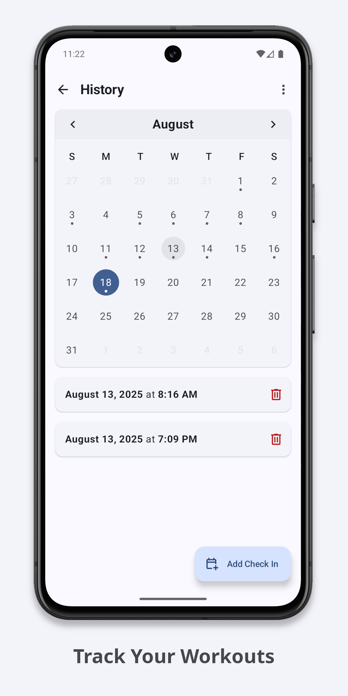

<p align="center"></p>
<h1 align="center"><b>CheckIn24</b></h1>
<h4 align="center">Offline, Material You, check in client for 24 Hour Fitness gym memberships</h4>
<p align="center">
    
    
    <br>
    
    
    
   


</p>

## About

Checkin24 is a lightweight, offline alternative to the official 24go app for checking into your 24 Hour Fitness gym built with Jetpack Compose. This app can NOT get you into the gym for free. An active 24 hour fitness membership is still required.

## Features 
- Fully offline
- All user data is stored locally
- Small app size
- Material You theming

## Screenshots
<p align="center">
    
    
    
    

</p>

## How it works

The data written in the check in qr code on the official 24go app is a JSON object in the following format: 

```json
{
  "SR":"24GO",
  "MB":"MBR00000000",
  "DT":1752738571206,
  "TP":"P",
  "OS":"Android",
  "AP":"1.78.1",
  "DI":"00000000-0000-0000-0000-000000000000"
}
```
- `SR` app name. default value: `"24GO"`
- `MB` user member number preceded by `"MBR"`
- `DT` unix time stamp in millis
- `TP` honestly don't know what this means but default value is `"P"`
- `OS` device operating system. in this case `"Android"`
- `AP` 24go app version. `"1.78.1"` at the time of 1.0.0 release. will update value as necessary to maintain functionality
- `DI` device advertising id. for a device with no advertising id this value is `"00000000-0000-0000-0000-000000000000"` which is also the value this app uses

CheckIn24 uses a user provided member number stored locally on the device to generate a valid QR code which can be used to check in to the gym

## Installation

Head over to the [Releases](https://github.com/sergcam/CheckIn24/releases) section and download the latest APK. Might add to F-Droid in the future

## Disclaimer 

This application comes with no guarantee of functionality or adherence to 24 Hour Fitness policy. It works for me. It might work for you. Use at your own discretion.

This app is not intended to facilitate membership sharing. Pretty sure photos are required now anyway

